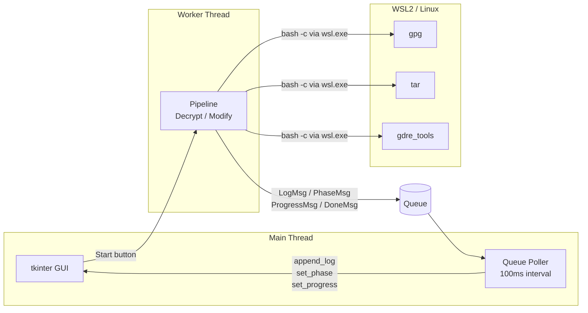
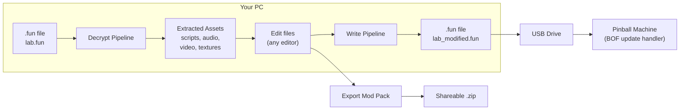
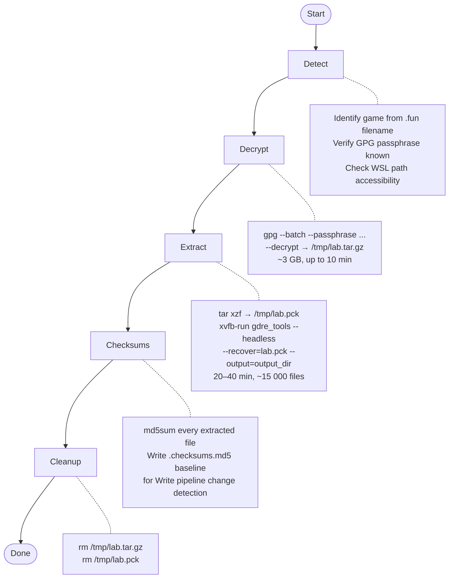
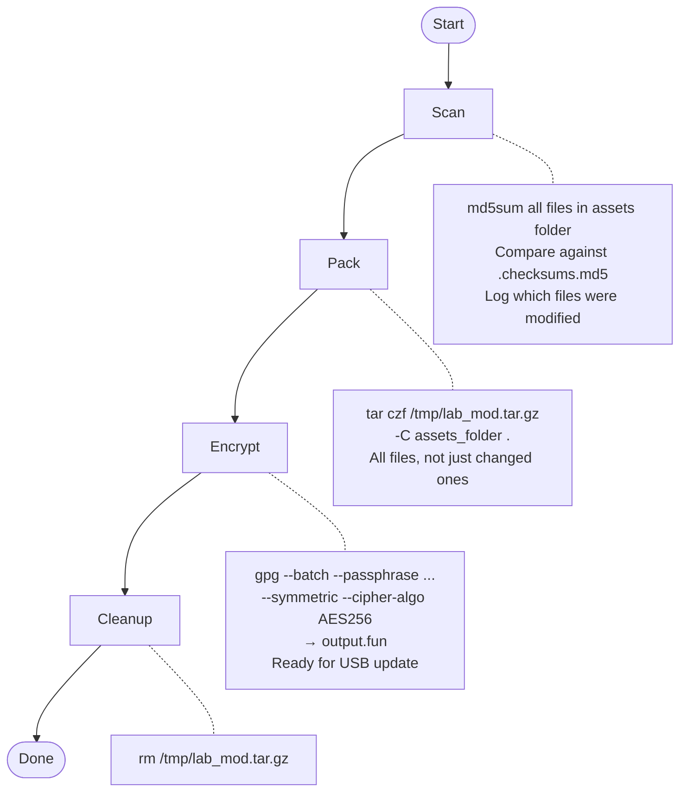
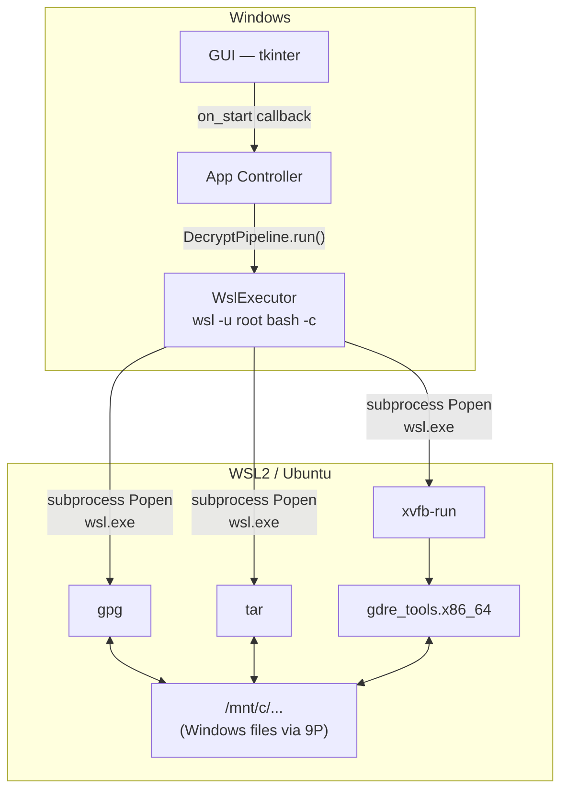

# BOF Asset Decryptor

A Windows GUI application for decrypting, exploring, and re-packaging game assets from **Barrels of Fun** (Kollect Fun) pinball machines — including Jim Henson's Labyrinth, Dune, and Winchester Mystery House. Turns a multi-step process involving GPG decryption, archive extraction, and Godot PCK decompilation into a single button click.

## What It Does

Barrels of Fun machines distribute game updates as GPG-encrypted `.fun` files. Inside each `.fun` file is a compressed tar archive containing a Godot 4 PCK (packed content) file. This tool:

1. **Detects** the game from the `.fun` filename and auto-selects the correct GPG passphrase
2. **Decrypts** the `.fun` file using GPG AES-256-CFB symmetric encryption
3. **Extracts** the tar archive to recover the Godot PCK file
4. **Decompiles** the PCK using [GDRE Tools](https://github.com/GDRETools/gdsdecomp) — recovering game scripts, textures, audio, video, and fonts in their original editable formats
5. **Generates checksums** of all extracted files so the Write pipeline can detect what you've changed
6. **Re-packs** modified assets back into a `.fun` file ready to write to USB and apply to the machine
7. **Mod Packs**: Export your modified files as a shareable zip, or import mod packs from other users

## Supported Games

| Game | `.fun` file |
|------|------------|
| Jim Henson's Labyrinth | `lab.fun` |
| Dune | `dune.fun` |
| Winchester Mystery House | `winchester.fun` |

## Requirements

**Game source**: the `.fun` code update file for your game, downloaded from the BOF support portal or copied from a USB update drive.

### Windows (required)

- **Windows 10/11** with WSL2 enabled
- **WSL2** with Ubuntu: `wsl --install`
- **GPG, tar, curl, xvfb, and unzip** in WSL — the app has an **Install Prerequisites** button that installs these automatically
- **GDRE Tools** — automatically downloaded and installed by the app (requires internet on first run)
- The app **auto-requests Administrator privileges** on launch (required for WSL operations)

> The decrypt and re-pack pipelines run entirely inside WSL. The GUI runs natively on Windows.

## Installation

### Option 1: Pre-built Installer (Recommended)

Download from the [Releases page](https://github.com/davidvanderburgh/bof-decryptor/releases):

- **Windows**: `BOF_Asset_Decryptor_Setup_v<version>.exe` — includes bundled Python runtime

**Setup steps:**

1. Run the installer (requires Administrator)
2. Optionally check **Install WSL2 prerequisites** during setup to install WSL2 + Ubuntu
3. Launch the app — it auto-requests elevation on startup
4. Click **Check Prerequisites** — if anything is missing, click **Install Prerequisites**
5. The app downloads and installs GPG, xvfb, and GDRE Tools in WSL automatically

The app checks for updates automatically on startup and shows release notes when a new version is available.

### Option 2: Run from Source

1. Install [Python 3.10+](https://www.python.org/downloads/)
2. Clone the repository:
   ```
   git clone https://github.com/davidvanderburgh/bof-decryptor.git
   cd bof-decryptor
   ```
3. Install WSL2 with Ubuntu: `wsl --install`
4. Launch:
   ```
   python -m bof_decryptor
   ```
   Or double-click `BOF Asset Decryptor.pyw` to launch without a console window.

No Python packages are required — the app uses only the standard library.

## Usage

The app has two tabs: **Decrypt** and **Write**.

### Decrypt Tab

Extract and decompile all game assets from a `.fun` file.

1. Launch the app — prerequisites are checked automatically
2. Click **Install Prerequisites** if anything shows as missing
3. Browse to your `.fun` file — the game is auto-detected from the filename
4. Set an output folder for the extracted assets
5. Click **Start Decryption**

The five pipeline phases run in sequence:

| Phase | What Happens |
|-------|-------------|
| **Detect** | Identifies the game from the `.fun` filename, verifies the GPG passphrase, checks that the WSL path is accessible |
| **Decrypt** | Runs `gpg --decrypt` inside WSL to produce a raw tar archive |
| **Extract** | Runs `tar xzf` to unpack the archive and recover the Godot PCK file |
| **Checksums** | GDRE Tools decompiles the PCK — recovering scripts, textures, audio, video, and fonts. Generates `.checksums.md5` baseline for the Write pipeline |
| **Cleanup** | Removes intermediate temp files (tar, raw PCK) from `/tmp` |

After decryption, you'll find all game assets in the output folder organized by Godot resource path (e.g. `res://assets/audio/`, `res://scenes/`, `res://scripts/`).

### Write Tab

After editing assets in the output folder, re-pack them into a new `.fun` file ready for USB.

1. Browse to the **assets folder** created by the Decrypt step
2. Browse to an **output `.fun` file** path (e.g. `lab.fun`)
3. Select the **game** from the dropdown
4. Click **Start**

The four pipeline phases:

| Phase | What Happens |
|-------|-------------|
| **Scan** | Compares every file in the assets folder against `.checksums.md5` to identify what you've changed |
| **Pack** | Creates a new tar.gz archive from the full assets folder |
| **Encrypt** | GPG-encrypts the archive with the game's passphrase, producing the output `.fun` file |
| **Cleanup** | Removes the intermediate tar file from `/tmp` |

Once you have a new `.fun` file, copy it to a USB drive and apply it to the machine the same way as any BOF update.

### Mod Pack Tab

Share your modifications with other users without sharing the full extracted game.

**Export:**
1. Decrypt the game and make your changes in the output folder
2. Click **Export Mod Pack** — saves a zip containing only the modified files

**Import:**
1. Decrypt your own game first (creates the `.checksums.md5` baseline)
2. Click **Import Mod Pack** and select the zip
3. Use the **Write** tab to rebuild and re-encrypt the `.fun` file

Mod packs are small (only changed files) and game-specific. They work across any machine running the same game title.

### Editing Assets

The Write pipeline does **not** re-run GDRE Tools — it simply re-packs whatever is in the output folder. This means you can edit files directly using any tool that suits the file type:

| File type | Where to find it | How to edit |
|-----------|-----------------|-------------|
| Audio (`.ogg`, `.wav`) | `res://assets/audio/` | Audacity, any audio editor |
| Video (`.ogv`) | `res://assets/video/` | ffmpeg, Kdenlive — output must be Theora `.ogv` |
| Textures (`.png`) | `res://assets/textures/`, `res://assets/images/` | Photoshop, GIMP, etc. |
| Game scripts (`.gd`) | `res://scripts/` | Any text editor |
| Scenes (`.tscn`) | `res://scenes/` | Godot editor (optional) |
| Config (`.cfg`, `.json`) | Various | Any text editor |

> Godot editor is only required if you need to re-import assets through Godot's asset pipeline (e.g. modifying scene graphs). For straight audio/video/texture swaps, edit files in place — the Write pipeline picks them up automatically.

## Architecture

```
bof_decryptor/
├── __init__.py      # Version string
├── __main__.py      # Entry point (python -m bof_decryptor), auto-elevates to admin
├── app.py           # Application controller — wires GUI ↔ pipeline via thread-safe queue
├── gui.py           # Tkinter GUI with dark/light theme, 2 tabs (Decrypt / Write)
├── pipeline.py      # DecryptPipeline + ModifyPipeline + mod pack export/import
├── config.py        # Game DB (passphrases, filenames), phase names, timeouts, settings path
├── executor.py      # Platform-aware command executor (WslExecutor / NativeExecutor)
└── updater.py       # Auto-update checker (GitHub releases API, stdlib only)
```

The app uses a **background thread + queue** pattern: the pipeline runs in a worker thread and posts `LogMsg`, `PhaseMsg`, `ProgressMsg`, and `DoneMsg` objects to a queue. The main thread polls the queue at 100ms intervals to update the GUI. This keeps the UI responsive during multi-hour GDRE decompilation runs.



## How It Works

### The `.fun` File Format

`.fun` files are GPG symmetrically encrypted archives:

```
lab.fun
└── GPG AES-256-CFB symmetric encryption (passphrase per game)
    └── tar.gz archive
        └── lab.pck  (Godot 4 packed content file)
            ├── scripts/       (.gdc bytecode → .gd source via GDRE)
            ├── assets/audio/  (.ogg, .wav)
            ├── assets/video/  (.ogv Theora)
            ├── assets/textures/ (.ctex → .png via GDRE)
            └── ...
```

The GPG passphrase is stored on the machine's Linux filesystem (in the update handler script) and hard-coded per game title in `config.py`.

### GPG Decryption

The pipeline runs GPG inside WSL:

```bash
gpg --batch --passphrase "<passphrase>" \
    --decrypt --output /tmp/lab.tar.gz lab_wsl_path.fun
```

The `.fun` files are 1–3 GB — GPG decrypt has a 10-minute timeout.

### PCK Extraction (GDRE Tools)

[GDRE Tools](https://github.com/GDRETools/gdsdecomp) v2.x is used to decompile the Godot 4 PCK:

```bash
xvfb-run -a gdre_tools.x86_64 --headless \
    --recover=lab.pck --output=/output/dir
```

GDRE runs headless (no display needed) and decompiles:
- **`.gdc` bytecode → `.gd` GDScript source** (full decompilation)
- **`.ctex` compressed textures → `.png`** (lossless export)
- **`.oggvorbisstr` streams → `.ogg`**
- **`.sample` → `.wav`**
- Other resource types are extracted as-is

GDRE decompilation of a full PCK typically takes 20–40 minutes and produces ~15,000 files.

### Re-packing

The Write pipeline reverses the process without involving GDRE:

```bash
# 1. Pack modified assets back into tar.gz
tar czf /tmp/lab_modified.tar.gz -C /output/dir .

# 2. Re-encrypt with GPG
gpg --batch --passphrase "<passphrase>" \
    --symmetric --cipher-algo AES256 \
    --output lab_modified.fun /tmp/lab_modified.tar.gz
```

The machine's update handler applies `.fun` files from USB using the same GPG passphrase, so the re-encrypted file is accepted as a valid update.

## Pipeline Details

### End-to-End Flow



### Decrypt Pipeline



### Write Pipeline



### Data Flow Through the Stack



## Troubleshooting

### Prerequisites show as missing after clicking Install

The install runs `apt-get` inside WSL. If it fails, check that:
- WSL can reach the internet: `wsl -- curl -s https://example.com`
- Ubuntu package lists are fresh: `wsl -u root -- apt-get update`

### GDRE Tools shows "No valid paths provided!"

This means GDRE started but couldn't find the PCK file. Check that:
- The `.fun` file successfully decrypted and the `.tar.gz` was extracted
- The PCK path in the log is accessible from WSL (`/mnt/c/...` paths require the drive to be mounted)

If the output folder is on an external drive plugged in after WSL started, WSL may not see it. Run `wsl --shutdown` and retry.

### GDRE Tools hangs or times out

GDRE decompilation of a full 3 GB game can take 20–40 minutes. The default timeout is 1 hour. If it consistently times out, check:
- No previous stuck GDRE processes: `wsl -- pkill -f gdre_tools`
- No previous Xvfb processes: `wsl -- pkill Xvfb`
- Sufficient disk space in the output folder (decompilation can produce 2–4 GB of files)

### "Write tab" produces a .fun file but the machine rejects it

The machine validates GPG symmetric encryption with its stored passphrase. Ensure:
- The correct game is selected in the Write tab dropdown
- The output `.fun` file is not corrupted (check its file size is similar to the original)
- The USB drive is FAT32-formatted (the BOF update handler may not read exFAT/NTFS)

### Output folder is empty or on an external drive

WSL2 only sees Windows drives that were connected when WSL started. If you're writing to an external drive plugged in afterward:
1. Run `wsl --shutdown` in a Windows terminal
2. Retry decryption

Alternatively, decrypt to a folder on C: and copy files afterward.

## Building the Installer

Requires [Inno Setup 6](https://jrsoftware.org/isinfo.php).

```powershell
cd installer
powershell -NoProfile -ExecutionPolicy Bypass -File build.ps1
```

Output: `installer/Output/BOF_Asset_Decryptor_Setup_v<version>.exe`

The build script downloads a Python embeddable distribution, copies tkinter from the local Python installation, patches the `._pth` file for the install layout, runs a smoke test, and compiles the Inno Setup installer — no pip packages required.

## Versioning

The version number lives in `bof_decryptor/__init__.py` as `__version__`. To release a new version:

1. Bump `__version__` in `bof_decryptor/__init__.py`
2. Commit and push
3. Tag and push: `git tag v<version> && git push origin v<version>`
4. GitHub Actions builds the Windows installer and attaches it to the GitHub Release automatically

The release body (changelog) is displayed inside the app when users on older versions launch — they see the release notes inline and a clickable link to download.

## License

MIT License. See [LICENSE](LICENSE) for details.
